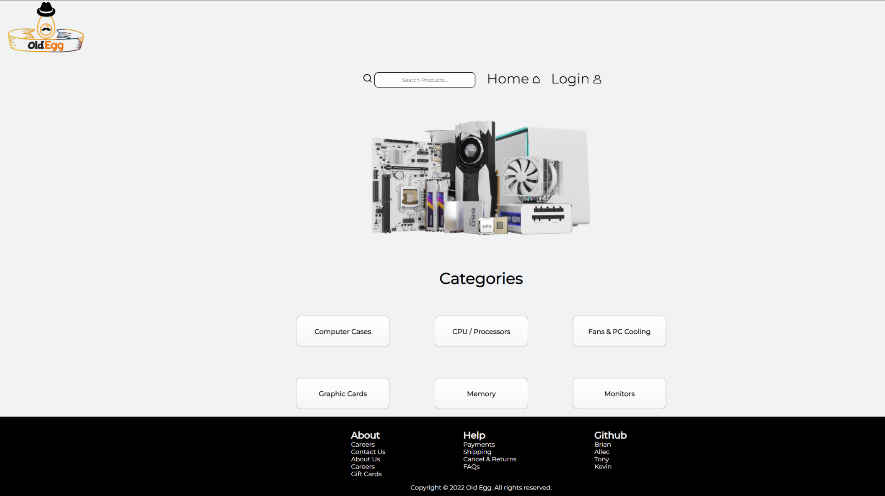

# OldEgg 📋




## Description 📍
- OldEgg utilizes both the front/back-end to provide a demo of an e-commerce website that sells electronics.

## Table Of Contents 📜
* [Installation](#installation)
* [Usage](#usage)
* [License](#license)
* [Contribution Guidelines](#contribution-guidelines)
* [Deployed Heroku Link](#heroku)
* [Github Repository](#github-repository)
* [Contact](#contact-information)

## Installation 
 1. Run ``` npm i ``` in the terminal to install the required dependencies
 2. Create an ```.env file``` and input the required MySql credentials
 3. Run the ```schema.sql``` (located in db folder) in the MySQL terminal to create the database and tables
 4. Run ```npm run seed``` to seed the database with data
 5. Run ```npm run start``` in the bash terminal start the server

## Usage 
- The application consists of 5 tables/models related to each other:
```
1. Users 
    - User ID (primary key)
    - Username
    - Password (hashed upon creation/update)
    - Email
    - First Name
    - Last Name
    - Balance

2. Categories
    - Category ID (primary key)
    - Category Name
    
3. Products
    - Product ID (primary key)
    - Product Name
    - Description
    - Price
    - Stock
    - Date Posted
    - Product Image
    - Product Category ID (foreign Key)

4. Carts
    - Cart ID (primary key)
    - User ID (foreign Key)
    - Product ID (foreign Key)
```

- The application utilizes handlebars to create a main layout that applies to several endpoints. The main handlebar layout consists of:

```
1. Nav bar 
    - When logged in:
        • Search bar
        • Home 
        • Logout
        • Cart
        • Wishlist
        • Profile

    - When logged out:
        • Search bar
        • Home
        • Login

2. Footer
    - Copyright
    - Navigation Links
```

- In conjunction with handlebars, the application implements express routes to communicate with the seeded data in the API to create endpoints. The endpoints are:

```
1. '/'
    - Homepage
    - Categories buttons 

2. '/login'
    - Login form
        - Email
        - Password
    - Sign up link

3. '/signup'
    - Sign up form
        - First name
        - Last name
        - Username (unique)
        - Email (unique)
        - Password (min 8 characters)
    - Login link

4. '/categories/:category_id'
    - Categories page
    - Lists all products in category selected
        - Product name
        - Image
        - Price
        - Stock
        - Product cards redirect to single products page on click.

5. '/products/:product_id'
    - Register page
    - Single product card
        - Category
        - Product name
        - Description
        - Price
        - Stock
        - Add to cart button 
        - Add to wishlist button

6. '/search/:product_id'
        - Search page
        - Lists all products in search input
        - Product name
        - Image
        - Price
        - Stock
        - Product cards redirect to single products page on click.

7. '/cart'
    - Product card(s) of item(s) inside cart
        - Product name
        - Image
        - Description
        - Price
        - Stock
        - Delete from cart button
        - Move to wishlist button
    - Total price of cart 
    - Checkout button

8. '/wishlist'- Wishlist page
    - Product card(s) of item(s) inside wishlist
        - Product name
        - Image
        - Description
        - Price
        - Stock
        - Delete from wishlist button
        - Move to cart button

9. '/cart/checkout'- Checkout page
    - Checkout form
        - First name
        - Last name
        - Email
        - Phone number
        - Address
        - City
        - State
        - Zipcode
    - Cart preview 
    - Total price of cart
    - Checkout button
        - Validates that there is enough money in ballance to account for items to purchase
        - If purchase successful, subtracts cart total from user balance

10. '/profile'
    - Change personal information
        - First name
        - Last name
        - Email
        - Password
    - View current money balance
```
##  Technologies Used
- Node
- Express
- Handlebars
- MySQL
- Sequelize
- AWS S3
- ES Lint
- Heroku

##  License
- This project uses the following license:<br>
     - ***MIT***

##  Contribution Guidelines 
- All contributors are welcome! Please don't hesitate to contact me below to contribute to this project.

##  Heroku
- [OldEgg Heroku](https://oldegg.herokuapp.com/)

##  Github Repository 
- [OldEgg Repository](https://github.com/brianalegre/OldEgg)

##  Contact Information
- Github Profiles:
    - [Brian Alegre](https://github.com/brianalegre)
    - [Tony Vallescas](https://github.com/Tonyavall)
    - [Kevin Lazaro](https://github.com/keeezy)
    - [Allec Arzadon](https://github.com/axe714)

